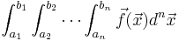
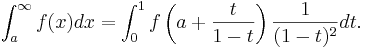
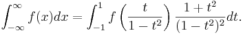

Cubature
--------

This is a simple 
package for **adaptive multidimensional integration** (*cubature*) of
**vector-valued integrands** over **hypercubes**, originally written by
[Steven G. Johnson](http://math.mit.edu/~stevenj) and ported to Java
by [Jonathan Schilling](http://labathome.de).  That is, it computes
integrals of the form:



(Of course, it can handle scalar integrands as the special case where
f is a one-dimensional vector: the dimensionalities of f
and x are independent.) The integrand can be evaluated for an
**array of points at once** to enable **easy parallelization**. The
code, which is distributed as **free software** under the terms of the
[GNU General Public License](w:GNU_General_Public_License "wikilink")
(v2 or later), implements an algorithm for adaptive integration.

The *h*-adaptive integration algorithm (recursively partitioning the
integration domain into smaller subdomains, applying the same
integration rule to each, until convergence is achieved), is based on
the algorithms described in:

-   A. C. Genz and A. A. Malik, “An adaptive algorithm for numeric
    integration over an N-dimensional rectangular region,” *J. Comput.
    Appl. Math.* **6** (4), 295–302 (1980).
-   J. Berntsen, T. O. Espelid, and A. Genz, “An adaptive algorithm for
    the approximate calculation of multiple integrals,” *ACM Trans.
    Math. Soft.* **17** (4), 437–451 (1991).

This algorithm is **best suited for a moderate number of dimensions**
(say, < 7), and is superseded for high-dimensional integrals by other
methods (e.g. [Monte Carlo](w:Monte_Carlo_integration "wikilink")
variants or [sparse grids](w:Sparse_grid "wikilink")).

(Note that we do *not* use any of the original DCUHRE code by Genz,
which is not under a free/open-source license.) Our code is based in
part on code borrowed from the [HIntLib numeric-integration
library](http://mint.sbg.ac.at/HIntLib/) by Rudolf Schürer and from code
for Gauss-Kronrod quadrature (for 1d integrals) from the [GNU Scientific
Library](http://www.gnu.org/software/gsl/), both of which are free
software under the GNU GPL. (Another free-software multi-dimensional
integration library, unrelated to our code here but also implementing
the Genz–Malik algorithm among other techniques, is
[Cuba](http://www.feynarts.de/cuba/).)

We are also grateful to Dmitry Turbiner (dturbiner ατ alum.mit.edu), who
implemented an initial prototype of the “vectorized” functionality (see
below) for evaluating an array of points in a single call, which
facilitates parallelization of the integrand evaluation.

Download
--------

The current version of the code is [Cubature.java](https://github.com/jonathanschilling/Cubature/blob/master/src/main/java/de/labathome/Cubature.java) on Github,
and the latest "official" version is available in Maven Central:

```
<dependency>
	<groupId>de.labathome</groupId>
	<artifactId>Cubature</artifactId>
	<version>1.0.3</version>
</dependency>
```

The [TestCubature.java](https://github.com/jonathanschilling/Cubature/blob/master/src/test/java/de/labathome/TestCubature.java) file contains some JUnit tests.

Usage
-----

The central subroutine you will be calling for h-adaptive cubature is:

```java
public static double[][] integrate(Object o, String method,
	double[] xmin, double[] xmax,
	double relTol, double absTol, Error norm,
	int maxEval,
	Object fdata);
```

This integrates a function F(x), returning a vector of `fdim` integrands,
where x is a `dim`-dimensional vector ranging from `xmin` to `xmax` (i.e. in a
hypercube xminᵢ ≤ xᵢ ≤ xmaxᵢ).

`maxEval` specifies a maximum number of function evaluations (0 for no
limit). (Note: the actual number of evaluations may somewhat exceed
`maxEval`: `maxEval` is rounded up to an integer number of subregion
evaluations.) Otherwise, the integration stops when the estimated
|error| is less than `absTol` (the absolute error requested) **or**
when the estimated |error| is less than `relTol` × |integral value|
(the relative error requested). (Either of the error tolerances can be
set to **Double.NaN to ignore** it.)

For vector-valued integrands (`fdim` > 1), `norm` specifies the norm that
is used to measure the error and determine convergence properties. (The
`norm` argument is irrelevant for `fdim` ≤ 1 and is ignored.) Given vectors
*v* and *e* of estimated integrals and errors therein, respectively, the
`norm` argument takes on one of the following enumerated constant values:

-   `Error.L1`, `Error.L2`, `Error.LINF`: the absolute error is measured
    as |e| and the relative error as |e|/|v|, where |...| is the
    [L₁](https://en.wikipedia.org/wiki/Taxicab_geometry),
    [L₂](https://en.wikipedia.org/wiki/Euclidean_distance), or
    [L∞](https://en.wikipedia.org/wiki/Uniform_norm)
    [norm](https://en.wikipedia.org/wiki/Norm_(mathematics)), respectively. (|x| in the
    L₁ norm is the sum of the absolute values of the components, in
    the L₂ norm is the root mean square of the components, and in the
    L∞ norm is the maximum absolute value of the components)

-   `Error.INDIVIDUAL`: Convergence is achieved only when each integrand
    (each component of v and e) individually satisfies the requested
    error tolerances.

-   `Error.PAIRED`: Like `Error.INDIVIDUAL`, except that the integrands
    are grouped into consecutive pairs, with the error tolerance applied
    in an L₂ sense to each pair. This option is mainly useful for
    integrating vectors of complex numbers, where each consecutive pair
    of real integrands is the real and imaginary parts of a single complex
    integrand, and you only care about the error in the complex plane rather
    than the error in the real and imaginary parts separately.

The `integrate` subroutine returns an array of dimensions `[2][fdim]`,
in which the integral value and the associated error estimates are stored.
The estimated errors are based on an embedded cubature rule of lower order;
for smooth functions, this estimate is usually conservative.

The integrand function `F` should be a function of the form:

```java
public double[][] eval(final double[][] x, Object fdata)
```

or alternatively, the Object `o` handed to `integrate` should implement the `Integrand` interface:

```java
public static interface Integrand {
	public abstract double[][] eval(final double[][] x, Object fdata);
}
```

Here, the input is a matrix `x` of dimensions `[dim][nPoints]` (the points to be
evaluated), the output is an array `fval` of dimensions `[fdim][nPoints]` (the vectors
of function values at the point `x`).

The `fdata` argument of `F` is equal to the `fdata` argument passed to
`integrate` - this can be used by the caller to pass any additional
information through to `F` as needed.
If the Object `o` given to integrate is an instance of a class, member variables
can be used for the same purpose. If `F` does not need any
additional data, you can just pass `null` for `fdata` and ignore the
`fdata` argument in `F`.

### “Vectorized” interface

This integration algorithm actually evaluates the integrand in
“batches” of several points at a time. It is often useful to have access
to this information so that your integrand function is not called for
one point at a time, but rather for a whole “vector” of many points at
once. 

The value of `nPoints` will vary with the dimensionality of the problem;
higher-dimensional problems will have (exponentially) larger `nPoints`,
allowing for the possibility of more parallelism. Currently, for
`integrate`, `nPoints` starts at 15 in 1d, 17 in 2d, and 33 in 3d, but as
`integrate` calls your integrand more and more times the value
of `nPoints` will grow. e.g. if you end up requiring several thousand points
in total, `nPoints` may grow to several hundred. We utilize an algorithm
from:

-   I. Gladwell, “Vectorization of one dimensional quadrature codes,”
    pp. 230–238 in *Numerical Integration. Recent Developments, Software
    and Applications*, G. Fairweather and P. M. Keast, eds., NATO ASI
    Series C203, Dordrecht (1987).

as described in the article “Parallel globally adaptive algorithms for
multi-dimensional integration” by [Bull and Freeman](http://citeseerx.ist.psu.edu/viewdoc/summary?doi=10.1.1.42.6638)
(1994).

### Example

As a simple example, consider the Gaussian integral of the scalar
function f(x) = exp(-sigma |x|²) over the hypercube
[-2,2]³ in 3 dimensions. Using `Cubature`, you can compute this integral e.g.
using a static member function as shown in
[ThreeDimGaussianStaticExample.java](https://github.com/jonathanschilling/Cubature/blob/master/src/main/java/de/labathome/ThreeDimGaussianStaticExample.java):

```java
import java.util.Locale;

public class ThreeDimGaussianStaticExample {

	public static double[][] gaussianNd(double[][] x, Object fdata) {
		int dim = x.length;
		int nPoints = x[0].length;
		double[][] fval = new double[1][nPoints];
		double sigma = (double) fdata;
		for (int i = 0; i < nPoints; ++i) {
			double sum = 0.0;
			for (int d = 0; d < dim; ++d) {
				sum += x[d][i] * x[d][i];
			}
			fval[0][i] = Math.exp(-sigma * sum);
		}
		return fval;
	}

	public static void ex_ThreeDimGaussian() {
		double[] xmin = { -2.0, -2.0, -2.0 };
		double[] xmax = { 2.0, 2.0, 2.0 };
		double sigma = 0.5;
		double[][] val_err = Cubature.integrate(ThreeDimGaussianStaticExample.class, "gaussianNd",
				xmin, xmax,
				1.0e-4, 0.0, Cubature.Error.INDIVIDUAL,
				0,
				sigma);
		
		System.out.println(String.format(Locale.ENGLISH,
				"Computed integral = %.8f +/- %g", val_err[0][0], val_err[1][0]));
	}

	public static void main(String[] args) {
		ex_ThreeDimGaussian();
	}
}
```

or using an object's member function as shown in
[ThreeDimGaussianMemberExample.java](https://github.com/jonathanschilling/Cubature/blob/master/src/main/java/de/labathome/ThreeDimGaussianMemberExample.java):

Here, we have specified a relative error tolerance of $10^{-4}$ (and no
absolute error tolerance or maximum number of function evaluations).
Note also that, to demonstrate the `fdata` parameter, we have used it to
pass the σ value through to our function (rather than "hard-coding" the
value of σ in `f` or using a member variable).

The output should be:

    Computed integral = 13.69609043 +/- 0.00136919

Note that the estimated *relative* error is 0.00136919/13.69609043 =
9.9969×10⁻⁵, within our requested tolerance of 10⁻⁴. The *actual*
error in the integral value, as can be determined e.g. by running the
integration with a much lower tolerance, is much smaller: the integral
is too small by about 0.00002, for an actual relative error of about
1.4×10⁻⁶. As mentioned above, for smooth integrands the estimated
error is almost always conservative (which means, unfortunately, that
the integrator usually does more function evaluations than it needs to).

### Infinite intervals

Integrals over infinite or semi-infinite intervals is possible by a
[change of variables](w:Integration_by_substitution "wikilink"). This is
best illustrated in one dimension.

To compute an integral over a semi-infinite interval, you can perform
the change of variables x=a+t/(1-t):



For an infinite interval, you can perform the change of variables
x=t/(1-t²):



Note the [Jacobian](w:Jacobian_matrix "wikilink") factors multiplying
*f*(⋅⋅⋅) in both integrals, and also that the limits of the *t*
integrals are different in the two cases.

In multiple dimensions, one simply performs this change of variables on
each dimension separately, as desired, multiplying the integrand by the
corresponding Jacobian factor for each dimension being transformed.

The Jacobian factors diverge as the endpoints are approached. However,
if f(x) goes to zero at least as fast as 1/x², then the limit of
the integrand (including the Jacobian factor) is finite at the
endpoints. If your f(x) vanishes more slowly than 1/x² but still
faster than 1/x, then the integrand blows up at the endpoints but the
integral is still finite (it is an integrable singularity), so the code
will work (although it may take many function evaluations to converge).
If your f(x) vanishes only as 1/x, then it is not [absolutely convergent](https://en.wikipedia.org/wiki/Absolute_convergence) and much more care is
required even to define what you are trying to compute. 
In any case, the h-adaptive quadrature/cubature rules currently employed in
`Cubature.java` do not evaluate the integrand at the endpoints, so you need
not implement special handling for |t|=1.

Tests
------------

JUnit tests should be added based on the [test.c](https://github.com/stevengj/cubature/blob/master/test.c)
suite of the original [cubature](https://github.com/stevengj/cubature) package.

The different test integrands are:

-   a product of cosine functions
-   a Gaussian integral of exp(-x²), remapped to [0,∞) limits
-   volume of a hypersphere (integrating a discontinuous function!)
-   a simple polynomial (product of coordinates)
-   a Gaussian centered in the middle of the integration volume
-   a sum of two Gaussians
-   an example function by Tsuda, a product of terms with near poles
-   a test integrand by Morokoff and Caflisch, a simple product of
    `dim`-th roots of the coordinates (weakly singular at the boundary)
